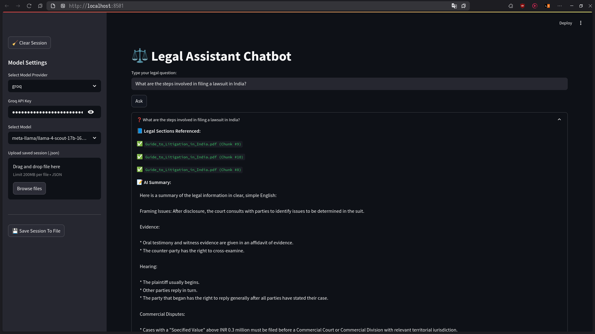
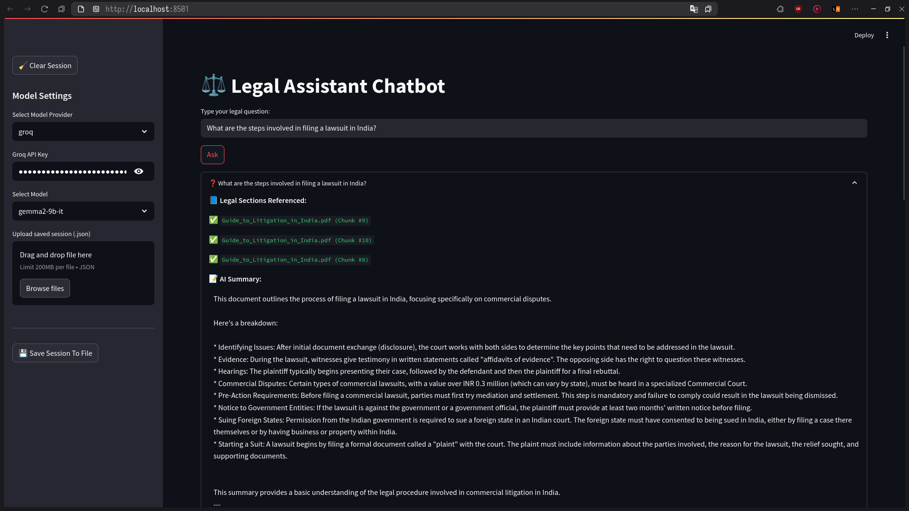
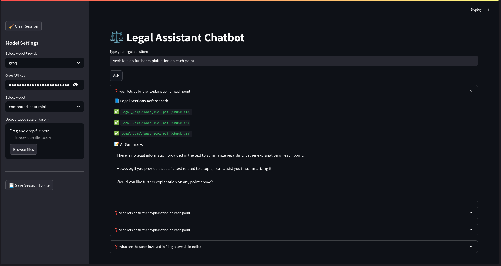

# GenAI Legal Assistant Chatbot

A powerful, modular legal chatbot that leverages multi-agent architecture to parse, retrieve, and summarize complex Indian legal documents in plain English — all through an interactive Streamlit interface.

Supports multiple LLM providers:

* **OpenAI** (ChatGPT)
* **Groq** (LLM-as-a-service)
* **Gemini** (Google)
* **Ollama** (local models like LLaMA3)

---

## Features

* **PDF Ingestion & Chunking** with FAISS vector search
* **Query-based Retrieval** from embedded legal content
* **Summarization Agent** using the selected LLM
* **Context-aware Chat Looping**
* **Save/Load Full Session** (incl. history + model + API keys)
* **Custom API key input** per provider
* **Local file dialogs for session saving**
* **Clear-all button** resets everything cleanly

---

## Tech Stack

| Component   | Tool/Library                 |
| ----------- | ---------------------------- |
| UI          | Streamlit                    |
| Vector DB   | FAISS                        |
| Embeddings  | Sentence Transformers        |
| PDF Parser  | PyMuPDF                      |
| LLM Support | OpenAI, Gemini, Groq, Ollama |
| File Dialog | Tkinter                      |

---

## Project Structure

```
genai-legal-bot
├── app.py                   # Main Streamlit UI app
├── pyproject.toml           # Poetry configuration
├── saved_sessions/          # Folder for saved JSON chat sessions
├── knowledge_base/          # Legal PDFs loaded into the system
│   ├── Guide_to_Litigation_in_India.pdf
│   └── Legal_Compliance_ICAI.pdf
├── data/
│   └── chunks.json          # Generated PDF chunks
├── agents/
│   ├── query_engine.py      # Handles vector search + retrieval
│   └── summarizer_agent.py  # Summarizes chunks using selected model
└── README.md
```

---

## Setup Instructions

### 1. Clone the Repo

```bash
git clone https://github.com/yourusername/genai-legal-bot.git
cd genai-legal-bot
```

### 2. Install Poetry & Dependencies

```bash
pip install poetry
poetry install
```

### 3. Add PDF files to `knowledge_base/`

Put any PDF documents you want to embed into the chatbot.

### 4. Run the App

```bash
poetry run streamlit run app.py
```

---

## Supported Model Providers & How to Use

### OpenAI

* Paste your `OPENAI_API_KEY` in the sidebar.
* Choose a model like `gpt-3.5-turbo`.

### Gemini

* Paste your `GOOGLE_API_KEY`.
* Models like `gemini-1.5-pro-latest` will appear.

### Groq

* Paste your `GROQ_API_KEY`.
* Select from `llama3-8b`, `mixtral`, or others.

### Ollama (local)

* Requires Ollama installed locally
* Make sure models like `llama3` are available via `ollama list`

---

## Example Use Flow

1. Upload your legal PDFs
2. Start typing a legal query like:

   > "What is the process to file a summary suit in India?"
3. Choose a model & enter API key (if needed)
4. View the retrieved legal sections + a plain-English summary
5. Save the session to pick up later


<br>

<br>


---

## Commands & Dev Utilities

### Clear Chunks & Re-Embed:

Delete `data/chunks.json` and re-run the app to regenerate chunks.

---

## License

MIT License — use, modify, and build freely.

---

## Credits

Built by \[Venkatarami Reddy] for legal-tech & GenAI innovation. Powered by open-source AI.

---

For support or contributions, open a GitHub issue or email: [chagantivenkataramireddy1@gmail.com](mailto:chagantivenkataramireddy1@gmail.com)
